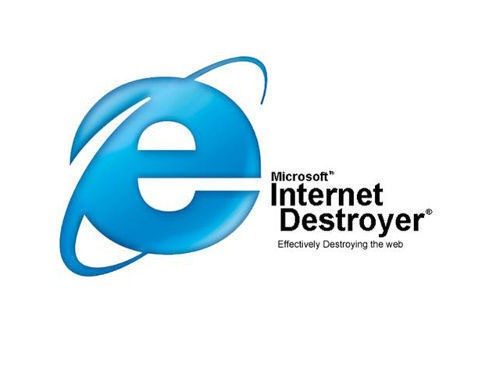

I have finally said to myself, it’s enough and decided to set up my blog. After keeping my stories, thoughts and endeavours off the internet for 22 years, you now got the chance to go full NSA on me. Just kidding. Please, don’t.

Since this is my first blog post, I feel kind of obligated to tell you about myself, to share my short life story. I am from a small but beautiful country called Slovenia. I like programming, and I’m a geek. But you could tell that from the title alone.

My first encounter with programming was at around age 10 when I learned about [Logo](https://en.wikipedia.org/wiki/Logo_%28programming_language%29) as a part of extracurricular activities. It was a fun experience, although I didn’t think of it as programming.

The what you could call real programming started at the age of 12 when I found a tutorial for creating a GUI application in Java and Swing. In hindsight, it probably wasn’t the best way to start; it was all very confusing. But I managed to run it. And it worked. I’ve felt this great feeling of accomplishment. Programmers will know about it. I’ve created something on my own. I was amazed at the fact that I could change some of the words (code) and text changed to something else, to whatever I wanted it to be. Immediately after, some immature and vulgar messages arose on my screen. Hey, I was 12, what did you expect? After I had a short period of childish fun, I set to create something useful: a calculator. It was a partial success, with just the very basic functionalities. But it got boring soon, and my lack of programming knowledge helped even further for me to lose interest for any further programming shenanigans.

Later, in 8th grade, at age 13, we had to pick a subject on our own. I don’t remember the other choices. I just know that I’ve chosen the one that had to do with computers, webpage design to be precise. Of course, they didn’t bother us with finer details of the glorious (_sarcasm_) HTML4, and it’s CSS2 companion. We had the “luxury” to use a GUI designer, where the HTML knowledge needed to create something resembling a webpage was next to none. I wanted to be fancy, so I also tried to learn some JavaScript. It wasn’t that fun making it work in Microsoft’s Internet Destroyer™, so I gave up shortly.

Microsoft’s Internet Destroyer™

Then came the time to go to the high school. Our school system is designed to offer us more career-centred programs along with the standard ones. I was deciding between Chemistry and Information Technology, the latter being the closest to my goal, Computer Science. I _was_ always very interested in chemistry, but my laziness prevailed. I decided to take the more natural way since I already knew a thing or two about computers.

The high school experience wasn’t too illuminating, probably the most important thing for me, learning-wise, was learning a bunch of new languages. We started with C++ then PHP and C#, some more PHP and at the end added some JavaScript in the mix. Plus I picked up Java myself again, this time having a much better understanding compared to my prior attempt. Our high school finishes with [Matura exam](https://en.wikipedia.org/wiki/Matura) , which is kind of similar to probably better-known [SATs](https://en.wikipedia.org/wiki/SAT) in the US. I was the best student in my program of our generation and ranked among the top students in the country.

I had no problems getting into the university CS program, and I even got the extra scholarship. I call it extra because studying here is funded by taxpayers money, any scholarship we get is extra spending money. I’ve quickly learned that Computer Science at university level is a lot of theory and not enough of doing things. It was a bit disappointing at first, but I’ve started to connect the dots later on. But it would be nice to get a chance and apply our knowledge in practice more often.

It’s still quite early in life for me to show off any serious working experience. I have a few personal projects open-sourced on [GitHub](https://github.com/markogresak) . My current work experience consists of only two summer internships and half a year of a part-time job with the other part being studying. For two consecutive years, I’ve worked for an information system’s company. There, my most important project was to completely re-do their support page and add a custom made ticketing system. It doesn’t sound like a difficult task at first. But I had to learn all about MVC, learn ASP.NET, brush up on my C# skills, and learn Less and find out how to apply Bootstrap to the project. I was also feeling adventurous, so I even tried CoffeeScript because why not?

Earlier this year, in March 2015, I’ve joined a local bioinformatics company, where I work as a front-end developer, helping to develop features or fix some problems. That is if I am not busy studying.

Other than being a total nerd, I also play the guitar. And I have an obsession for keeping my hair on point at all times.

This is it, my brief history. I hope you’ve enjoyed your creep in my life.
