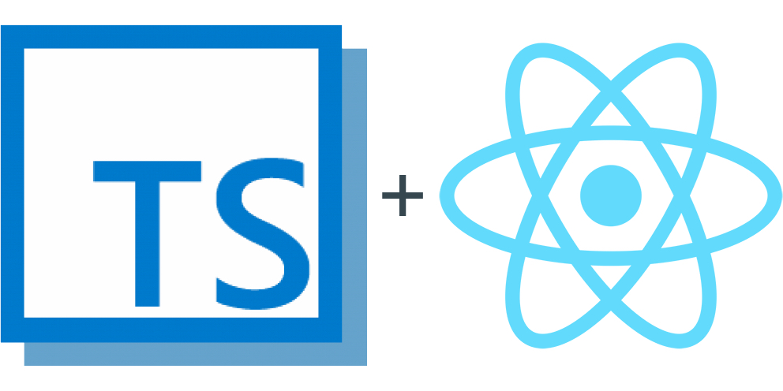

TypeScript introduced 1.6 beta on their [blog](http://blogs.msdn.com/b/typescript/archive/2015/09/02/announcing-typescript-1-6-beta-react-jsx-better-error-checking-and-more.aspx) in early September 2015, announcing they're adding JSX support. I decided to convert my project. Here is what I've learned.

_Disclaimer: This post was originally written in early September 2015, when TypeScript was finishing their implementation of.tsx file format. It was more than a year since then, and things changed._

### Summary:

#### Why use TypeScript?

- For better productivity.

#### TypeScript + JSX?

- Only in new.tsx file extension.
- The compiler has JSX transformer.
- _Note_: Type casting <Type> variable changes to (variable as Type).

#### Making the switch:

- `npm install typescript`
- Rename files to end in `.tsx`. A short [`js-to-tsx`](https://github.com/markogresak/js-to-tsx) script can help.
- (Fix compiler errors)

#### Adding Webpack:

- Use [`ts-loader`](https://github.com/jbrantly/ts-loader) for files matching `/\.tsx?\$/`.

#### Conclusion:

- It's not difficult, and it's worth the time.

Take a look at [TypeScript with React and JSX](https://github.com/markogresak/typescript-react-jsx-example) example on GitHub.

_Update: On September 16th, [the TypeScript team officially released version 1.6](http://blogs.msdn.com/b/typescript/archive/2015/09/16/announcing-typescript-1-6.aspx). Since then, it's not required to install `typescript@next` to get the version with JSX support._

### Why use TypeScript?

If you're not familiar with [TypeScript](http://www.typescriptlang.org/) , it's a superset of JavaScript with additional optional typing. With typing, a lot of which is done with type inference and doesn't need explicit definitions, you will get full autocomplete and compile-time warnings or errors in your editor, IDE or at build stage. This makes the development productivity comparable to statically typed languages like C#, Java, C++ or similar. These features are great for productivity when working on any project, and the benefits only scale up with the growth of the project and the team.

You can also get completions for most libraries and frameworks out there. You achieve this by adding type definition files (.d.ts) to your project. These are available from [DefinitelyTyped repository](https://github.com/borisyankov/DefinitelyTyped) or via [tsd CLI](https://www.npmjs.com/package/tsd) , which can be used to manage typing files similarly to npm.

**tl;dr**: For productivity.

### What about TypeScript +JSX?

TypeScript and React could be used together from the beginning, but TypeScript didn’t support the JSX syntax until recent 1.6 version. This meant you had to use, for example

```js
React.createElement("div", null, "Hello ", this.props.name)
```

instead of more familiar XML (or HTML, if you will) syntax

```js
<div>Hello {this.props.name}</div>
```

Atom's plugin [`atom-typescript`](https://atom.io/packages/atom-typescript) was offering compiling JSX syntax before the official support, but it was using [Babel](https://babeljs.io/) compiler to do that.

Also, Babel, or more accurately ES2015 syntax, is a bit different and therefore can't compile all of TypeScript's features, for example, class access modifiers. Don't get me wrong, I love Babel, it's a great tool, and I use it a lot. But I try to write TypeScript with little dependency on the editor. Therefore I prefer not to divert from standard features too much.

With official support, there are some important changes worth noting. TypeScript was already using `<Type>` syntax for casting a variable to a different type, which collides with JSX syntax and they can't just break old code. They addressed the issue by adding support in files with new `.tsx` extension. For type casting in these files, they've added the keyword as, so you can replace `<Type>` variable with `(variable as Type)`.

**tl;dr**: You will have to use `.tsx` file extension. Typecasting `<Type>` variable changes to `(variable as Type)`.

### Switching to TypeScript

#### Installing the new version of TypeScript compiler

For support for JSX syntax with TypeScript compiler, the first step is to use TypeScript version 1.6 beta or better.

At the time of writing, version 1.6 beta is available on npm as a nightly build. You can install it with `npm install typescript`. The compiler doesn't just allow the JSX syntax; it's also packed with transformer, so you don't need to worry about extra build step.

**tl;dr**: `npm install typescript`

### Changing file extensions

I decided to change all `.js` files in my project to `.tsx`, even those who will probably never contain any JSX syntax. It's easier than changing it later.

But because I'm lazy and annoyed by renaming each file, I've created a script that converts all `.js` and `.jsx` files to `.tsx`. For your convenience, I've posted it below, so you can copy the script and run it in your terminal. There is also a script which will rename `.js` and `.jsx` to `.ts` and `.tsx`, respectively.

_Never execute scripts unless you know what will they do!_

Explanation of the script below:

`find .`: find all files in the current working directory (`.`) and recursive in all subfolders. Arguments:

- `-type f`: Match only regular files.
- `\( -iname '_.js' -or -iname '_.jsx' \)`: Use case insensitive name matching, match files ending in `.js` or `.jsx`. Note that surrounding brackets have to be escaped to interpret it correctly.
- `-not -wholename '_node_modules_'`: Match `node_modules` in the whole path, negate matches, which means any path including `node_modules` are ignored.
- `-exec sh -c 'mv "$1" "${1%.js*}.tsx"' \_ {} \;`: Execute a `sh` command and pass it `{},` which is current file path, as first argument (`$1`). The script uses `mv` (move files) command to move `$1` ([relative] path to each file it found) to the same path, but with replaced `.js\*` (`.js` or `.jsx`) extension with `.tsx` (TypeScript React). If the terminology _move_ confuses you, don't worry, it's not moving the files anywhere, just renaming them.

Since this code is changing your file names and might not work correctly, make sure to use source control or back up your work before running the script.

Also note that this script will rename all.js and.jsx files from current folder and all subfolders to `.tsx`.

```bash
find . -type f \( -iname '_.js' -or -iname '_.jsx' \) \
  -not -wholename '_node_modules_' \
  -exec sh -c 'mv "$1" "${1%.js\*}.tsx"' \_ {} \;
```

If you wish to instead rename `.js` and `.jsx` to `.ts` and `.tsx` respectively, use the following script. The only thing changed in this script, compared to above, is the last part:

- `` 'mv "\$1"`sed -re "s/\.js(x)?$/\.ts\1/g" <<< "$1"\`' ``: Command `sed` (stream editor) is used to replace matching regex `\.js(x)?$` (`.js` or `.jsx` at end of string) with `.ts(x)`, where the `x` of `.tsx` is added only if it existed in old extension.

```bash
find . -type f \( -iname '_.js' -or -iname '_.jsx' \) \
  -not -wholename '_node_modules_' -exec sh \
  -c 'mv "\$1"`sed -re "s/\.js(x)?$/\.ts\1/g" <<< "$1"`' \_ {} \;
```

If you find any issues with this script, report them as an issue at [js-to-tsx](https://github.com/markogresak/js-to-tsx) repository.

**tl;dr**: Rename `.js` files to `.tsx`. Use script above or get it at [`js-to-tsx`](https://github.com/markogresak/js-to-tsx) . _Make sure you know what you're going to run!_

### Adding typings and fixing errors

To get the most advantage of using TypeScript in combination with React, I recommend adding typings for all modules you are using, if you can find it. Typings are TypeScript's _"magic sauce"_ which give compiler information about modules and allowing it to provide better completions.

I prefer to use [tsd](https://www.npmjs.com/package/tsd) , which is package manager for TypeScript's typings and behaves similarly to npm. Also, as mentioned earlier, you could go to the [DefinitelyTyped repository](https://github.com/borisyankov/DefinitelyTyped) and copy typings to your project directly from there.

If you are migrating an existing JavaScript project to TypeScript, there might be some compilation errors. There is, unfortunately, no simple guide or solution for all of them. I still tried to describe the three most common cases I've encountered:

- _Cannot find module [module]_: You're trying to use `import... from '[module]'`, but did not install typings for the [module]. If the typings are not available, you can get away with the commonJS `const... = require('[module]')`. It will work the same, and the only drawback is that `require` returns TypeScript's type `any`, therefore you will have no completions available. Another case would be that you are globally importing the module/library. In this case, you can [manually declare](http://www.typescriptlang.org/Handbook#modules-optional-module-loading-and-other-advanced-loading-scenarios) the module with `declare var [module]` to tell TypeScript this variable exists and it's fine for you to use it.
- _Module [module] has no default export_: When importing the module as `import [module] from '[module]'`, you might occur this error. Although it has more to do with JavaScript/EcmaScript module spec than just JavaScript, you can fix it by either importing just the exports you need with syntax `import {submodule1, submodule2,...} from '[module]'` or use `import \* as [module] from '[module]'` to import everything into a [module] object, the latter being equivalent to `[module] = require('[module]')`.
- _Supplied parameters do not match function signature_: TypeScript is very strict about calling functions. If you're expecting a parameter of type `string`, or TypeScript infers the type for you, you will have to call the function with string as a parameter. Depending on your case, possible workarounds would be changing function signature, how you're calling the function or changing the parameters to be [optional/default](http://www.typescriptlang.org/Handbook#functions-optional-and-default-parameters) . I always try not to be lazy and fix the code to make compiler as helpful as possible.

If you encounter some special cases with specific modules, I'm sorry, but I can't cover all of those here. Try with [TypeScript handbook](http://www.typescriptlang.org/Handbook) , at module's GitHub page or on the Stack Overflow.

**tl;dr**: [`tsd`](https://www.npmjs.com/package/tsd) is recommended for maintaining typings. Check the solutions for common problems and try solving module-specific problems at its GitHub page.

### Adding Webpack

Webpack is an excellent tool for the development build process, and it's often used with React. I am using it a lot recently, not only for React development, but also for all front-end projects. It allows compiling of ES2015+, TypeScript, module importing with import or require and pre-processing styles with Less, Sass or other preprocessors and more. If you are unfamiliar with Webpack, their [getting started](https://webpack.github.io/docs/tutorials/getting-started/) guide will cover most of the basics you need to know. I warmly recommend to use it.

For TypeScript, there are few loaders available, and I prefer to use [ts-loader](https://github.com/jbrantly/ts-loader) since it's working for most of my use cases. Since we have installed TypeScript with JSX transformer, ts-loader can use it for all our compilation requirements. Adding it to Webpack requires two steps:

1. resolve `.ts` and `.tsx` extensions (both can be matched with `\.tsx?\$` regex)
2. add `ts-loader` as a module loader

Your `webpack.config.js` should contain at least:

```js
module.exports = {
  resolve: {
    extensions: ["", ".js", ".ts", ".tsx"],
  },
  module: {
    loaders: [{ test: /\.tsx?$/, loaders: "ts-loader" }],
  },
}
```

I use this extensions template for my projects, and I've included `.js` to match imports of npm modules, which are still in plain JavaScript. This configuration is straightforward and probably needs at least an entry point script. Explaining how the whole Webpack works would take a whole post and you can already find very good resources on learning Webpack.

**tl;dr**: Use [`ts-loader`](https://github.com/jbrantly/ts-loader) for files matching `/\.tsx?\$/`, as seen in webpack config snippet above.

### Conclusion

I am noticing increased productivity after switching to TypeScript since the beginning. Now there is finally official support for the feature I was waiting for a long time. The switch from React with ES2015+ isn't that painful and shouldn't take too long, and it's well worth the time.

Again, to see an example, check out my [TypeScript with React and JSX](https://github.com/markogresak/typescript-react-jsx-example) example on GitHub.

If you have anything to share about this project, feel free to leave a comment below or as an issue on example project's GitHub page.
